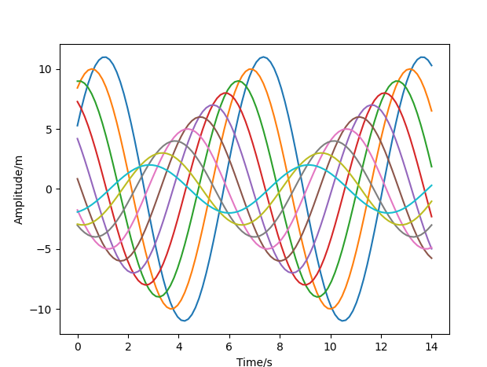

# Flipped Sine Graphs

## Description
This code defines a function called sinplot which generates a plot of sinusoidal curves. This function named sinplot takes two optional parameters n and flip. n determines the number of sine curves to be plotted, and flip determines whether the curves are flipped or not. This code generates 100 evenly spaced points between 0 and 14. These points are the x-coordinates for plotting the sine curves.
Inside the loop, plt.plot() function is used to plot each sinusoidal curve. The np.sin() function generates the sine values for each x-coordinate, x + i * .5 shifts the sine curve horizontally for each iteration of the loop, and (n + 2 - i) * flip determines the amplitude of the curve, with flip controlling the direction of the flip.

In summary, this function generates a plot with multiple sinusoidal curves, each slightly shifted horizontally and potentially flipped vertically, with the number and properties of the curves determined by the parameters n and flip.
## Table of Contents
- [Flipped Sine Graphs](#flipped-sine-graphs)
  - [Description](#description)
  - [Table of Contents](#table-of-contents)
  - [Installation](#installation)
  - [Usage](#usage)
  - [License](#license)
  - [Contributing](#contributing)
  - [Credits](#credits)
  - [Tests](#tests)
  - [Questions](#questions)

## Installation
pip install pandas
pip install jupyter
pip install seaborn
pip install matplotlib

## Usage

A screenshot of the paitplots shown here:

The repository can be accessed using this link:https://github.com/Mikemupararano/flipped-sine-curves.

## License
This application is covered under the MIT license.

## Contributing
 N/A

## Credits
https://seaborn.pydata.org/tutorial/aesthetics.html
## Tests
N/A

## Questions
For any questions or concerns, please contact me at [kudath@yahoo.co.uk](mailto:kudath@yahoo.co.uk).
You can also find me on GitHub: [https://github.com/Mikemupararano](https://github.com/https://github.com/Mikemupararano)
